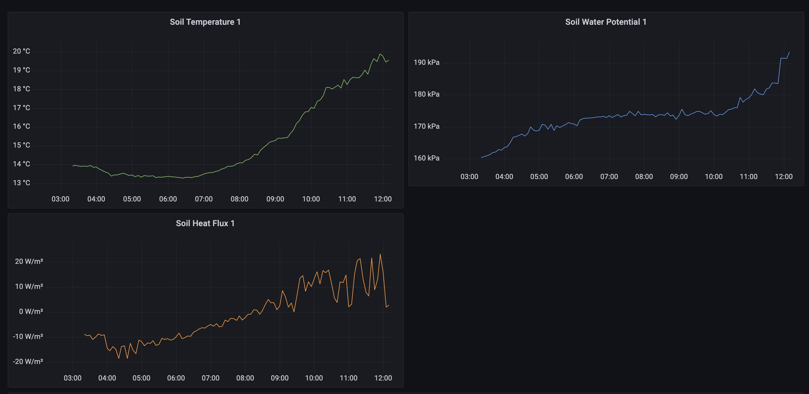
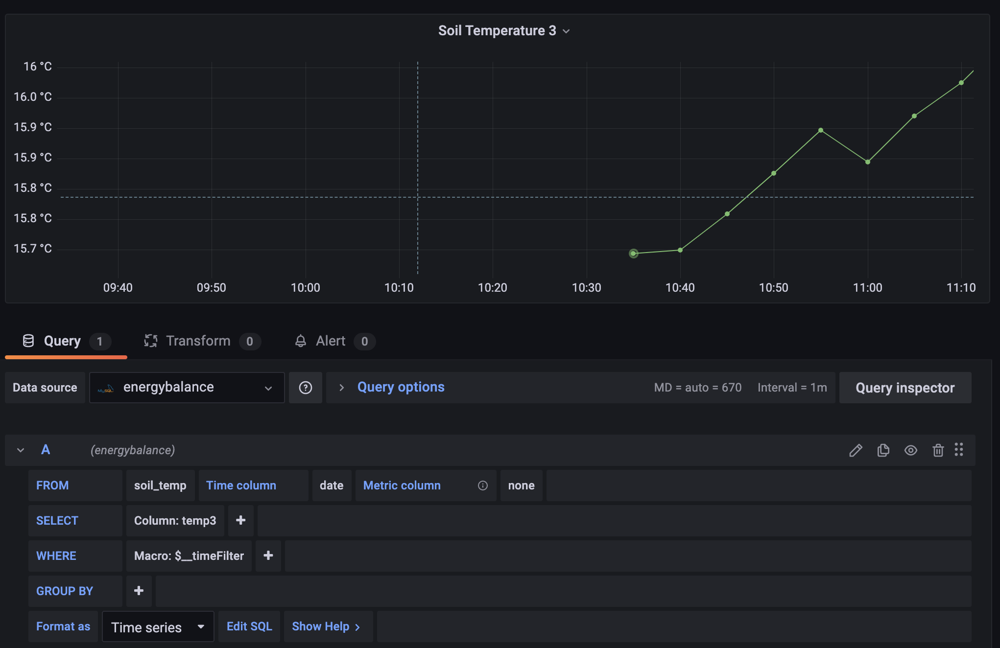

=======
Grafana
=======

Grafana can be used to visualize data and can be used in conjunction with the download_data.py and add_to_mysql.py `scripts`_ (script numbers 1 and 3) to create plots that are kept up to date. 

The MySQL database that you create when using the add_to_mysql.py script can be set up as a data source for Grafana. 

With the data download and add to MySQL scripts running in 5 minute intervals with cron jobs, the data will be kept up to date.

For an example, see the image below:

This shows the data for the Soil Temperature, Soil Water Potential and Soil Heat Flux for sensor channel 1. This allows you to see changes in the data over time and notice any anomalies.
You can set the time range to be much smaller or larger than that shown in the image and can zoom in on data to see it in more detail.

These plots are time series plots, but there are many more types of plot available such as bar chart, gauge, pie chart and others.

There are other configurable options on Grafana. For example, it is possible to set up alerts if the data exceeds or goes below a certain value. You can also share a snapshot of the dashboard you create with someone else.

Install
-------

- See instructions at https://grafana.com/tutorials/install-grafana-on-raspberry-pi/ for setting up Grafana on a Raspberry Pi.
- To set up MySQL as a data source see https://grafana.com/docs/grafana/v7.5/datasources/mysql/

.. _scripts: https://ncas-energy-balance-1-software.readthedocs.io/en/latest/scripts.html

Create a plot
-------------

- To create plots you must create a new dashboard, then use the 'add panel' button in the top right corner.
- Then, under ``Query``, you can select the data source required (my database is called ``energybalance``), the table from the database to use (my table is called ``soil_temp``), and set the time column and the column to plot. (In the image below, the time column is called ``date`` and the column I am plotting is called ``temp3``.)

- There are options to change the name of the plot and colours, axis names etc. on the right hand side.