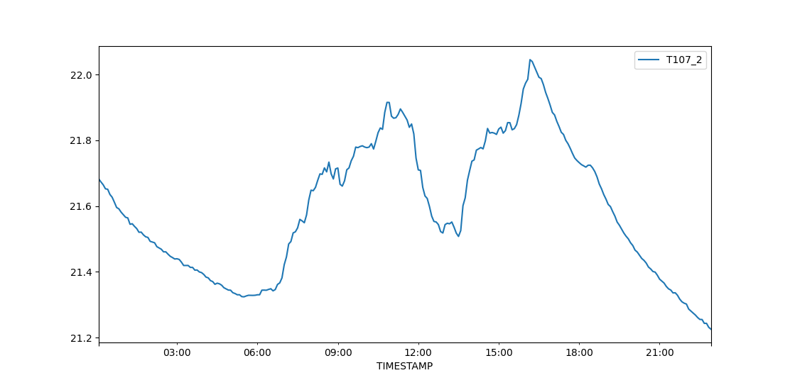

.. _scripts:

=======
Scripts
=======

The scripts make use of the package PyCampbellCR1000 (on an updated fork) - this works for CR3000 loggers as well.
The documentation for this package can be found here: https://pycampbellcr1000.readthedocs.io/en/latest/

To see the API and source code for these scripts, go to `api`_.

Various settings used in these scripts can be set/changed in the config file: ncas-energy-balance-1-software/energy_balance/etc/config.ini.
This includes input/output file paths and settings for netcdf global attributes.
This is explained on the `config`_ page.

.. note::
    To change the default config settings, provide your own config file by setting the environment variable CONFIG as the file path to your file.
    e.g.

    .. code-block:: console

        $ export CONFIG='path/to/my/config.ini' 

.. note::
    To find your datalogger URL you must know:
        - Whether are you connecting via tcp/ip or serial
        - If tcp/ip, you need the ip and the port you are connecting to. (URL = 'tcp:host-ip:port')
        - If serial, you need the path to the port and the baud rate of the port. (URL = 'serial:path:baudrate') 
        - For serial connections, You can also provide the byte size, parity and stop bits if required, this is assumed to be '8N1' if not provided. (e.g. 'serial:/dev/ttyUSB0:115200:8N1') 

Use the ``-h`` option on any script to see the command line arguments available.
  
**1. download_data.py:**

- Created to be set up as a cron job every 5 minutes (or another time interval). This downloads data from tables on the logger and saves to a daily csv file. Doing this provides a stream of data and saving as daily files allows netCDF files to easily be created. 
- The script updates the time of the logger at midnight, to prevent the logger time drifting. So if set up to run every 5 minutes, the logger clock will be reset daily.
- The script does not take any command line arguments.
- The files are made in the directory specified in the config file, under ``logger_csv_path``, under another directory named after the table e.g. ``<logger_csv_path>/SoilMoisture/SoilMoisture_2021-07-21.csv``
- The datalogger URL must be set in the config file e.g. serial:/dev/ttyUSB0:115200 or tcp:host-ip:port (see above note explaining this.)
- Edit ``logger_tables`` in the config file to change the tables downloaded. The default tables are Housekeeping, GPS_datetime, SoilTemperature, SoilMoisture, SoilHeatFlux and Radiation, these are AMOF specific.

To run once:

.. code-block:: console
    
    $ cd energy_balance/scripts
    $ python download_data.py

This will produce an output if successful, example given below, showing how many records were found (repeated for each table):
::
    
    Your download is starting.
    Packet 0 with 13 records
    Packet 1 with 14 records
    Packet 2 with 14 records
    ---------------------------
    41 new records were found

To set up a cron job:

.. code-block:: console

    $ crontab -e 
    
Add a command, such as the one below, to this file:

.. code-block::

    */5 * * * * . /home/pi/ncas-energy-balance-1-software/venv/bin/activate && /home/pi/ncas-energy-balance-1-software/energy_balance/scripts/download_data.py >> /home/pi/campbell_data/data-download-cron.log 2>&1

The section ``. /home/pi/ncas-energy-balance-1-software/venv/bin/activate`` activates the virtual environment.
This sets this script running every 5 minutes. The first file path needs to point to your virtual environment and the second to the location of the script.
The final file path points to the location at which to write a log file. This can be excluded if this is not required.

The command:

.. code-block:: console

    $ crontab -l

will list cron jobs you have set up.

**2. download_data_by_date.py:**

- Intended to be used to bulk download data over a range of days. 
- Useful if system has been turned off/ was down etc.
- This downloads data from tables on the logger and saves to a daily csv file.
- The files are made in the directory specified in the config file, under ``logger_csv_path``, under another directory named after the table e.g. ``<logger_csv_path>/SoilMoisture/SoilMoisture_2021-07-21.csv``
- Can be used in conjunction with the ``download_data.py`` script. For example, if the ``download_data.py`` script has stopped working over a period time, the ``download_data_by_date.py`` script can be used to fill in these missing days, and will fill partially complete daily files as well.
- The datalogger URL must be set in the config file e.g. serial:/dev/ttyUSB0:115200 or tcp:host-ip:port
- The start and end dates of the days to download should be provided on the command line (in the format YYYY-MM-DD). A start date is required but an end date is not. If an end date is not provided, data is downloaded only for the day provided as the start date.
- If a file for a day has partial data, this script will download the rest of the data for that day, following on from the latest entry in that file.
- Edit ``logger_tables`` in the config file to change the tables downloaded. The default tables are Housekeeping, GPS_datetime, SoilTemperature, SoilMoisture, SoilHeatFlux and Radiation.

To run:

The below command will download data for 21/07/2021, 22/07/2021 and 23/07/2021 and create a csv file for each day. 

.. code-block:: console
    
    $ cd energy_balance/scripts
    $ python download_data_by_date.py -s 2021-07-21 -e 2021-07-23

This next command will download data only for 21/07/2021.

.. code-block:: console
    
    $ python download_data_by_date.py -s 2021-07-21

You will see a statement saying ``Data downloaded for ...`` once this is complete.

**3. add_to_mysql.py:**

- This script will load the csv data for today's files, created by the ``download_data`` script, into MySQL tables, providing the tables have already been created in the database. For information on creating tables in MySQL, see https://dev.mysql.com/doc/refman/8.0/en/creating-tables.html 
- These updating tables could then be used as a source for visualizing the data, for example with Grafana. This would mean the plots could be kept up to date and allow you to see the data in real time.
- This could be set up as cron job along with the ``download_data`` script, to keep the tables up to date. See explanation below.
- Edit ``logger_tables`` and ``mysql_tables`` in the config file to change the table names to those of your table names from the logger and the corresponding tables you have created in MySQL. 
- The default values used for the MySQL tables are housekeeping, gps, soil_temp, soil_moisture, soil_heat_flux and radiation. The defaults used for the logger tables are Housekeeping, GPS_datetime, SoilTemperature, SoilMoisture, SoilHeatFlux and Radiation.
- The top level directory containing the csv files is taken from the config file (under ``logger_csv_path``), assumed to be the same as that used to create the files. (i.e. the same as that used for the ``download_data.py`` script)
- The username, password and database name should also be provided as command line arguments. See below:

.. code-block:: console
    
    $ cd energy_balance/scripts
    $ python add_to_mysql.py -u <username> -p <password> -d <database>

This will output ``Inserted data into MySQL tables`` if successful.

Setting up as a cron job:

If the download data script is set up every 5 minutes, this script could be set up to run on a 5 minute interval but 3 minutes after the download data script.
The jobs in the crontab file would like this:

.. code-block::

    */5 * * * * . /home/pi/ncas-energy-balance-1-software/venv/bin/activate && /home/pi/ncas-energy-balance-1-software/energy_balance/scripts/download_data.py >> /home/pi/campbell_data/data-download-cron.log 2>&1
    3-59/5 * * * * . /home/pi/ncas-energy-balance-1-software/venv/bin/activate && /home/pi/campbell_data/mysql_insert/add_to_mysql.py -u<username> -p<password> -d<database-name> >> /home/pi/campbell_data/cron_output/mysql-cron.log 2>&1 

For extra security, the username and password for the database could be passed in from a text file, preventing them appearing in any logs. This can be done by using the path to the text file as below:

.. code-block::

    3-59/5 * * * * . /home/pi/ncas-energy-balance-1-software/venv/bin/activate && /home/pi/campbell_data/mysql_insert/add_to_mysql.py `cat /home/pi/campbell_data/mysql_insert/args.txt` >> /home/pi/campbell_data/cron_output/mysql-cron.log 2>&1

where ``/home/pi/campbell_data/mysql_insert/args.txt`` contains ``-u<username> -p<password> -d<database-name>``

This means that the download data script would run at 00:00, 00:05, 00:10, 00:15 and every 5 minutes after.
The mySQL script would run at 00:03, 00:08, 00:13 and every 5 minutes after.

**4. create_files.py:**

- This script can be used to make netCDF files, that conform to the NCAS-GENERAL Data Standard, for soil and radiation data products. Quality control is carried out during this step, and quality control variables are included in the netCDF file.
- Further details of the values used for quality control by these scripts can be found at: `qc`_
- The quality control level used to calculate valid min/max values is the value set in the config file under ``qc_flag_level``.
- Information on how the netCDF file should be built can be found at https://sites.google.com/ncas.ac.uk/ncasobservations/home/data-project/ncas-data-standards/ncas-amof/. Example files can also be found here.
- For this to work, ensure settings in the config file are filled in correctly, e.g. column names, input files, input date format
- Some of the quality control settings can be adjusted in the config file. e.g. the max/min temperature expected for Soil Temperature and the lower and upper bounds for the cleaning time of the radiation sensors. It would be sensible to discuss these settings with the instrument scientist.
- The script takes some command line arguments to specify options for the creation of the files.
- The files are created at the ``netcdf_path`` specified in the config file.

:: 

    usage: create_files.py [-h] -s START_DATE [-e END_DATE] [-f {daily,monthly}]
                        -d {soil,radiation}

    optional arguments:
    -h, --help            show this help message and exit
    -s START_DATE, --start-date START_DATE
                            The start date to create netCDF files for. e.g.
                            '2021-07-30' when creating daily files, '2021-07' when
                            creating monthly files.
    -e END_DATE, --end-date END_DATE
                            The end date to create netCDF files for. e.g.
                            '2021-07-30' when creating daily files, '2021-07' when
                            creating monthly files. This is inclusive.
    -f {daily,monthly}, --frequency {daily,monthly}
                            The frequency for creating the netCDF files, options
                            are daily or monthly. The default is monthly.
    -d {soil,radiation}, --data-product {soil,radiation}
                            The data product to create files for.

A start date is required, but an end date is not. If an end date is not provided, files are only created for the given start date. An example of usage is below.

To create a monthly netCDF file for June 2021, July 2021 and August 2021 for soil:

.. code-block:: console
    
    $ cd energy_balance/scripts
    $ python create_files.py -s 2021-06 -e 2021-08 -f monthly -d soil

The file created for June 2021 would be ``ncas-energy-balance-1_<platform>_202106_soil_v<version>.nc``, where platform and version are set in the config file.

To create a monthly netCDF file for soil for July 2021 only:

.. code-block:: console
    
    $ cd energy_balance/scripts
    $ python create_files.py -s 2021-07 -f monthly -d soil

The file created would be called ``ncas-energy-balance-1_<platform>_202107_soil_v<version>.nc``, where platform and version are set in the config file.

To create daily netCDF files for each day between 20th July 2021 and 27th July 2021 for radiation:

.. code-block:: console
    
    $ cd energy_balance/scripts
    $ python create_files.py -s 2021-07-20 -e 2021-07-27 -f daily -d radiation

A file would be created for each day, e.g. for 20th July 2021: ``ncas-energy-balance-1_<platform>_20210720_radiation_v<version>.nc``, where platform and version are set in the config file.

**5. calculate_valid_min_max.py:**

- This script allows you to recalculate the valid min/max variables after manually changing the values of a quality control flag variable.
- For example, the qc flag variable for ``soil_temperature`` is ``qc_flag_soil_temperature``. If values of the qc flag variable are changed, it may change the valid minimum/maximum.
- The quality control level used remains the value set in the config file under ``qc_flag_level``.
- To update the valid max/min values, use this script as below:

.. code-block:: console
    
        $ cd energy_balance/scripts
        $ python calculate_valid_min_max.py -v soil_temperature -qc qc_flag_soil_temperature -fp /path/to/ncas-energy-balance-1_lab_20210730_soil_v0.1.nc

Once complete, you will see a message, e.g. ``Recalculated valid min and valid max for soil_temperature, using qc_flag_soil_temperature as a mask, with qc flag value of 1``

In general, the usage is:

::

    usage: calculate_valid_min_max.py [-h] [-v VAR_NAME] [-qc QC_VAR_NAME] -fp FILE_PATH

    optional arguments:
        -h, --help              show this help message and exit
        -v VAR_NAME, --var-name VAR_NAME
                                The name of the variable to update the min/max on.
                                e.g. 'soil_temperature'
        -qc QC_VAR_NAME, --qc-var-name QC_VAR_NAME
                                The name of the quality control variable to use as a
                                mask for retrieving valid values. e.g.
                                'qc_flag_soil_temperature'
        -fp FILE_PATH, --file-path FILE_PATH
                                The path to netCDF file on which to recalculate the
                                min/max e.g. /path/to/my/file.nc

**6. create_qc_csvs.py:**

- This script will generate csvs for soil/radiation data that have been quality controlled according the level of quality control specified in the config file. These can then be plotted to see how changing the quality control changes the plot.
- This will only apply automatic quality control as discussed in `qc`_ and will not take into account any manual changes done on the netCDF file.
- Only columns used as variables in the netCDF files will be included. In the soil files these are: soil temperature, soil water potential, soil heat flux. In the radiation files: downwelling longwave radiation in air, upwelling longwave radiation in air, downwelling shortwave radiation in air, upwelling shortwave radiation in air and radiometer body temperature.
- The name of the file created will be ``<data_product>_qc_<date>.csv`` e.g. ``soil_qc_20210730.csv``. 
- The files are made in the directory specified in the config file, under ``qc_csv_path``.
- The quality control carried out flags data outside operational bounds, suspect data and data taken when sensors are being cleaned. To do this a quality control matrix is created, assigning each value a quality control flag. These are numbers from 0 to 255.
  
    - 0 is not used.
    - 1 means the data is 'good' i.e. it is within operational and expected bounds and hasn't raised any suspicion.
    - Further values 2, 3, 4 etc. are assigned specific definitions e.g. 2 could mean the data is outside the operational bounds, 3 could mean there is a timestamp error.
    - Further details of the values used for quality control by these scripts can be found at: `qc`_

- The flag level to use can be set in the config file under ``qc_flag_level``. Setting the level as 1, means only 'good' data is provided. This can be increased to include data from other qc flags, as described by the variables in the NetCDF files. (The level chosen will include data from that level and below.)
- Some of the quality control settings can be adjusted in the config file. e.g. the max/min temperature expected for Soil Temperature and the lower and upper bounds for the cleaning time of the radiation sensors. It would be sensible to discuss these settings with the instrument scientist.
- These csvs can be plotted using script #6 below.

:: 

        usage: create_qc_csvs.py [-h] -s START_DATE [-e END_DATE] [-f {daily,monthly}]
                                -d {soil,radiation}

        optional arguments:
        -h, --help            show this help message and exit
        -s START_DATE, --start-date START_DATE
                                The start date to create files for. e.g.
                                '2021-07-30' when creating daily files, '2021-07' when
                                creating monthly files.
        -e END_DATE, --end-date END_DATE
                                The end date to create files for. e.g.
                                '2021-07-30' when creating daily files, '2021-07' when
                                creating monthly files. This is inclusive.
        -f {daily,monthly}, --frequency {daily,monthly}
                                The frequency for creating the csv files, options
                                are daily or monthly. The default is monthly.
        -d {soil,radiation}, --data-product {soil,radiation}
                                The data product to create files for.

.. code-block:: console
    
        $ cd energy_balance/scripts
        $ python create_qc_csvs.py -s 2021-07-30 -f daily -d radiation

An example of how the data could look before and after the quality control, in csv format, is shown below:

BEFORE:

::

    Datetime,WP_kPa_1,T107_1,shf_1
    2021-07-30 00:00:00,101.2294921875,21.69464111328125,0.4606184959411621,
    2021-07-30 00:05:00,67.27587890625,21.682518005371094,8.577472686767578
    2021-07-30 00:10:00,55.2167313385,21.796310424804688,2.078993320465088
    2021-07-30 00:15:00,86.1962890625,21.664581298828125,0.1369409263134002

AFTER:

::

    Datetime,WP_kPa_1,T107_1,shf_1
    2021-07-30 00:00:00,,21.69464111328125,0.4606184959411621,
    2021-07-30 00:05:00,67.27587890625,21.682518005371094,8.577472686767578
    2021-07-30 00:10:00,55.2167313385,21.796310424804688,2.078993320465088
    2021-07-30 00:15:00,,21.664581298828125,0.1369409263134002

The 2 soil water potential values (column WP_kPa_1) over 80kPa hav been masked out, as this is one of the quality control settings.

**7. plot_csv.py:**

- This script can be used to generate quick plots from csv files, provided the file contains a date/time column, using matplotlib. It will plot the csv columns you specify against datetime.
- The name of the datetime column must be specified in the config file, under ``datetime_header``.
- This will allow you take a quick look at any data, and could be used to look at how the plot changes when data is masked from the quality control.
- The command line options allow you to specify the datetimes to plot between and which columns of the csv to plot.
- If a start and/or end date are not provided, these will default to the start/end times in the csv.

:: 

    usage: plot_csv.py [-h] [-s START] [-e END] -f FILE -c COLUMNS

    optional arguments:
    -h, --help            show this help message and exit
    -s START, --start START
                            The start date/time for the plot in 'YYYY-MM-dd
                            HH:MM:SS' format. e.g. '2021-07-10 04:00:00'.
    -e END, --end END     The end date/time for the plot in 'YYYY-MM-dd
                            HH:MM:SS' format. e.g. '2021-07-10 16:00:00'.
    -fp FILE_PATH, --file-path FILE_PATH
                            The path to the csv file to plot. e.g. /path/to/file.csv
    -c COLUMNS, --columns COLUMNS
                            The columns from the csv to plot against datetime,
                            provide as comma separated list if more than one e.g. 'IR01Dn,IR01Up'.

Note that datetimes should be provided in quotations to allow them to be parsed correctly.

.. code-block:: console
    
    $ cd energy_balance/scripts
    $ python plot_csv.py -s '2021-07-10 04:00' -e '2021-07-10 16:00' -fp /path/to/my/file.csv -c shf_1,shf_2,shf_3

An example plot, of temperature from sensor 2, is show below:

The command for this was:

.. code-block:: console
    
    $ python plot_csv.py -s '2021-07-30 00:00:00' -e '2021-07-30 23:59:00' -fp path/to/SoilTemperature_2021-07-30.csv -c T107_2

.. _api: https://ncas-energy-balance-1-software.readthedocs.io/en/latest/api.html#scripts
.. _config: https://ncas-energy-balance-1-software.readthedocs.io/en/latest/config.html
.. _qc: https://ncas-energy-balance-1-software.readthedocs.io/en/latest/quality_control.html